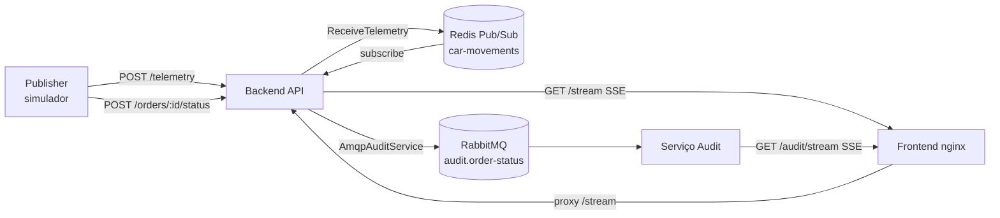

# Rastreamento de entregas

Monorepo com serviços separados seguindo **Arquitetura Limpa** (Ports and Adapters).
Telemetria em tempo real via **Redis Pub/Sub + SSE**; auditoria de status via **RabbitMQ**.



## Estrutura

```
gps-tracking-SSE/
├── package.json              # npm workspaces (shared + services/*)
├── docker-compose.yml        # Dev: Redis, RabbitMQ, backend, audit, publisher, frontend
├── docker-compose.prod.yml   # Produção (VPS): imagens buildadas, só nginx na 8083
├── README.md
├── docs/                     # Documentação do projeto
│   ├── service-backend.md
│   ├── service-audit.md
│   ├── service-publisher.md
│   ├── adr.md
│   └── links-e-comandos.md
├── shared/                   # Contratos compartilhados entre serviços
│   ├── package.json
│   ├── tsconfig.json
│   └── src/audit/
│       ├── constants.ts      # AUDIT_ORDER_STATUS_QUEUE
│       ├── order-status-audit.ts
│       └── index.ts
├── services/
│   ├── backend/              # API HTTP, SSE, Redis e AMQP
│   │   ├── Dockerfile
│   │   ├── package.json
│   │   ├── tsconfig.json
│   │   └── src/
│   │       ├── domain/entities/
│   │       ├── application/use-cases/
│   │       ├── application/ports/
│   │       ├── infrastructure/redis/
│   │       ├── infrastructure/amqp/
│   │       ├── interfaces/http/
│   │       └── main/
│   ├── audit/                # Consumidor de eventos de auditoria
│   │   ├── package.json
│   │   ├── tsconfig.json
│   │   └── src/
│   │       ├── domain/entities/
│   │       ├── application/use-cases/
│   │       ├── application/ports/
│   │       ├── infrastructure/amqp/
│   │       ├── infrastructure/logging/
│   │       ├── infrastructure/storage/
│   │       ├── interfaces/http/
│   │       └── main/
│   └── publisher/            # Simulador de rotas e telemetria
│       ├── package.json
│       ├── tsconfig.json
│       └── src/
│           ├── domain/entities/
│           ├── application/use-cases/
│           ├── application/ports/
│           ├── infrastructure/http/
│           ├── infrastructure/osrm/
│           └── main/
└── frontend/                 # Dashboard estático (HTML + nginx)
    ├── index.html
    └── nginx.conf
```

Cada serviço em `services/` possui as camadas:

- `domain/` — entidades e regras puras
- `application/` — casos de uso e portas (interfaces)
- `infrastructure/` — adaptadores (Redis, AMQP, OSRM, HTTP)
- `interfaces/` — entrada HTTP (`backend` e `audit`)
- `main/` — composição e bootstrap

## Executar com Docker

Dev (código montado via volume, `tsx watch`):

```bash
docker compose up
```

Produção (imagens buildadas; na VPS a porta pública é `8083`):

```bash
cp .env.example .env
docker compose -f docker-compose.prod.yml up -d --build
```

URLs, deploy na VPS e comandos do dia a dia: [docs/links-e-comandos.md](docs/links-e-comandos.md).

| Serviço    | URL / Porta (dev)                    |
| ---------- | ------------------------------------ |
| Frontend   | http://localhost:3000                |
| Backend    | http://localhost:8080                |
| Audit      | http://localhost:8081                |
| Redis      | localhost:6379                       |
| RabbitMQ   | http://localhost:15672 (management)  |

## Executar localmente (sem Docker)

Requer Redis e RabbitMQ acessíveis (ou apenas Redis se não for testar auditoria).

```bash
npm install
npm run dev:backend     # porta 8080
npm run dev:audit       # consome fila AMQP e expõe HTTP na porta 8081
npm run dev:publisher   # simula rotas e envia telemetria
```

Scripts adicionais na raiz:

```bash
npm run typecheck       # verifica tipos nos três serviços
npm run build           # compila TypeScript dos serviços
```

Para o frontend local, sirva `frontend/index.html` com proxy de `/stream` apontando ao backend, ou acesse via Docker na porta 3000.

## API do backend

| Método | Rota                        | Descrição                              |
| ------ | --------------------------- | -------------------------------------- |
| GET    | `/health`                   | Health check                           |
| POST   | `/telemetry`                | Recebe posição do motorista            |
| GET    | `/stream`                   | SSE de movimentos (`event: carMoved`)  |
| POST   | `/orders/:orderId/status`   | Atualiza status do pedido (auditoria)  |

### Telemetria

`POST /telemetry` recebe a posição do motorista e o destino do pedido. O caso de uso `ReceiveTelemetry` calcula `remainingDistanceKm` com Haversine e publica no Redis (canal `car-movements`).

Corpo esperado:

```json
{
  "orderId": "string",
  "driverId": "string",
  "lat": 0,
  "lng": 0,
  "destinationLat": 0,
  "destinationLng": 0,
  "routeName": "IFF Centro -> Boulevard Shopping",
  "route": [{ "lat": 0, "lng": 0 }]
}
```

`route` (geometria OSRM restante) e `routeName` são opcionais.

Resposta **202** com o evento enriquecido (`TelemetryUpdate`).

### Streaming (SSE)

`GET /stream` envia eventos `carMoved` com o JSON de `TelemetryUpdate`:

```json
{
  "orderId": "simulated-order-1",
  "driverId": "simulated-driver-1",
  "position": { "lat": -21.7545, "lng": -41.3245 },
  "destination": { "lat": -21.7681, "lng": -41.3392 },
  "routeName": "IFF Centro -> Boulevard Shopping",
  "route": [{ "lat": -21.7545, "lng": -41.3245 }],
  "remainingDistanceKm": 1.234,
  "receivedAt": "2026-08-06T18:00:00.000Z"
}
```

### Auditoria

`POST /orders/:orderId/status` dispara `UpdateOrderStatus`, que publica na fila `audit.order-status`. O serviço `audit` consome e registra os eventos de forma independente.

Status aceitos: `ARRIVED_AT_LOCATION`, `DELIVERED` (com aliases em português).

Contratos compartilhados ficam em `shared/src/audit/`.

## API do audit

O serviço `audit` expõe HTTP na porta `8081` (no Docker, o nginx faz proxy de `/audit/`):

| Método | Rota                 | Descrição                                      |
| ------ | -------------------- | ---------------------------------------------- |
| GET    | `/health`            | Health check                                   |
| GET    | `/audit/deliveries`  | Lista entregas (`DELIVERED`), mais recentes    |
| GET    | `/audit/stream`      | SSE de entregas (`event: deliveryRecorded`)    |

## Frontend

Dashboard em `frontend/index.html` (Leaflet + `EventSource`):

- Mapa com marcador animado, pino de destino, trilha percorrida e rota planejada (OSRM)
- Sidebar com status da conexão, pedido/rota, coordenadas, distância e horário
- Painel de auditoria via `EventSource("/audit/stream")`
- Troca de rota detectada pela mudança de `orderId` no SSE
- Proxy SSE configurado em `frontend/nginx.conf` (`/stream` → backend, `/audit/` → audit)

## Variáveis de ambiente

| Variável                 | Serviço    | Padrão                          |
| ------------------------ | ---------- | ------------------------------- |
| `PORT`                   | backend    | `8080`                          |
| `REDIS_URL`              | backend    | `redis://redis:6379`            |
| `CAR_MOVEMENTS_CHANNEL`  | backend    | `car-movements`                 |
| `AUDIT_AMQP_URL`         | backend, audit | `amqp://rabbitmq:5672`      |
| `AUDIT_HTTP_PORT`        | audit      | `8081`                          |
| `TELEMETRY_URL`          | publisher  | `http://backend:8080/telemetry` |
| `ORDER_STATUS_BASE_URL`  | publisher  | `http://backend:8080`           |
| `SIMULATION_INTERVAL_MS` | publisher  | `1500`                          |

## Documentação

Os documentos ficam em [`docs/`](docs/):

- [docs/service-backend.md](docs/service-backend.md) — API HTTP, Redis Pub/Sub e SSE
- [docs/service-audit.md](docs/service-audit.md) — consumidor AMQP e API de entregas
- [docs/service-publisher.md](docs/service-publisher.md) — simulador de rotas
- [docs/adr.md](docs/adr.md) — decisões arquiteturais (SSE, Redis, Haversine, AMQP, Clean Architecture)
- [docs/links-e-comandos.md](docs/links-e-comandos.md) — URLs e comandos de dev/produção
