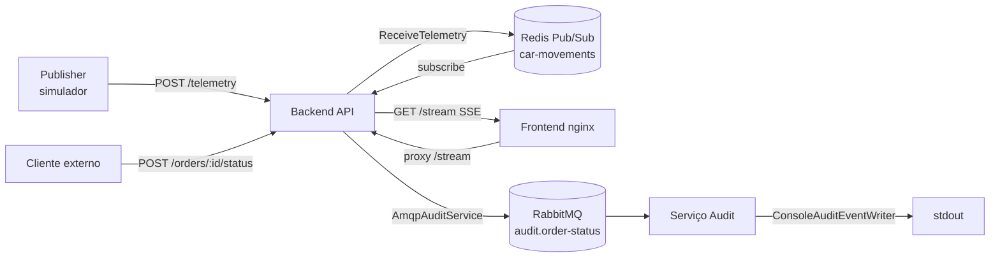

# Arquitetura do sistema

## Visão geral

Plataforma de rastreamento de entregas em tempo real organizada como **monorepo**
com serviços independentes. Cada serviço segue **Arquitetura Limpa** (Ports and
Adapters).



## Estrutura do repositório

```
gps-tracking-SSE/
├── package.json
├── docker-compose.yml
├── README.md
├── architecture.md
├── adr.md
├── shared/
│   ├── package.json              # @gps-tracking/shared
│   ├── tsconfig.json
│   └── src/audit/
│       ├── constants.ts          # AUDIT_ORDER_STATUS_QUEUE
│       ├── order-status-audit.ts # OrderStatus, OrderStatusAudit
│       └── index.ts
├── services/
│   ├── backend/                  # @gps-tracking/backend
│   │   ├── Dockerfile
│   │   ├── package.json
│   │   ├── tsconfig.json
│   │   └── src/
│   │       ├── domain/entities/
│   │       │   ├── telemetry.ts
│   │       │   └── car-movement.ts
│   │       ├── application/
│   │       │   ├── use-cases/
│   │       │   │   ├── receive-telemetry.ts
│   │       │   │   ├── stream-car-movements.ts
│   │       │   │   └── update-order-status.ts
│   │       │   └── ports/
│   │       │       ├── car-movement-publisher.ts
│   │       │       ├── car-movement-subscriber.ts
│   │       │       └── audit-service.ts
│   │       ├── infrastructure/
│   │       │   ├── redis/
│   │       │   │   ├── redis-car-movement-publisher.ts
│   │       │   │   └── redis-car-movement-subscriber.ts
│   │       │   └── amqp/
│   │       │       └── amqp-audit-service.ts
│   │       ├── interfaces/http/
│   │       │   ├── create-app.ts
│   │       │   └── controllers/
│   │       │       ├── telemetry-controller.ts
│   │       │       ├── stream-car-movement-controller.ts
│   │       │       └── order-status-controller.ts
│   │       └── main/
│   │           └── main.ts
│   ├── audit/                    # @gps-tracking/audit
│   │   ├── package.json
│   │   ├── tsconfig.json
│   │   └── src/
│   │       ├── domain/entities/
│   │       │   └── order-status-audit.ts
│   │       ├── application/
│   │       │   ├── use-cases/
│   │       │   │   └── record-order-status-audit.ts
│   │       │   └── ports/
│   │       │       └── audit-event-writer.ts
│   │       ├── infrastructure/
│   │       │   ├── amqp/
│   │       │   │   └── amqp-order-status-consumer.ts
│   │       │   └── logging/
│   │       │       └── console-audit-event-writer.ts
│   │       └── main/
│   │           └── main.ts
│   └── publisher/                # @gps-tracking/publisher
│       ├── package.json
│       ├── tsconfig.json
│       └── src/
│           ├── domain/entities/
│           │   ├── route.ts
│           │   └── telemetry-payload.ts
│           ├── application/
│           │   ├── use-cases/
│           │   │   └── simulate-delivery-routes.ts
│           │   └── ports/
│           │       ├── route-provider.ts
│           │       └── telemetry-sender.ts
│           ├── infrastructure/
│           │   ├── http/
│           │   │   └── http-telemetry-sender.ts
│           │   └── osrm/
│           │       └── osrm-route-provider.ts
│           └── main/
│               └── main.ts
└── frontend/
    ├── index.html
    └── nginx.conf
```

## Componentes

| Componente | Responsabilidade | Tecnologia |
| --- | --- | --- |
| `backend` | API HTTP, cálculo de distância, Redis Pub/Sub e SSE | Node.js 20, Express 5, TypeScript, Redis 6, amqplib |
| `audit` | Consome e registra eventos de status | Node.js 20, AMQP |
| `publisher` | Simula rotas (OSRM) e envia telemetria | Node.js 20, OSRM, fetch |
| `frontend` | Dashboard com mapa em tempo real | HTML, Leaflet 1.9, nginx |
| `shared` | Tipos e constantes de auditoria | TypeScript (`@gps-tracking/shared`) |

## Camadas por serviço

### Backend

| Camada | Conteúdo |
| --- | --- |
| `domain` | `Telemetry`, `TelemetryUpdate`, `CarMovement`, `Coordinates` |
| `application` | `ReceiveTelemetry`, `StreamCarMovements`, `UpdateOrderStatus` |
| `application/ports` | `CarMovementPublisher`, `CarMovementSubscriber`, `AuditService` |
| `infrastructure` | `RedisCarMovementPublisher`, `RedisCarMovementSubscriber`, `AmqpAuditService` |
| `interfaces/http` | `create-app.ts`, controllers Express |
| `main` | Wiring de dependências e bootstrap |

### Audit

| Camada | Conteúdo |
| --- | --- |
| `domain` | `OrderStatusAudit` (reexportado de `@gps-tracking/shared`) |
| `application` | `RecordOrderStatusAudit` |
| `application/ports` | `AuditEventWriter` |
| `infrastructure` | `AmqpOrderStatusConsumer`, `ConsoleAuditEventWriter` |
| `main` | Bootstrap do consumidor AMQP |

### Publisher

| Camada | Conteúdo |
| --- | --- |
| `domain` | `RouteConfig`, `TelemetryPayload` |
| `application` | `SimulateDeliveryRoutes` |
| `application/ports` | `RouteProvider`, `TelemetrySender` |
| `infrastructure` | `OsrmRouteProvider`, `HttpTelemetrySender` |
| `main` | Rotas pré-definidas (Campos dos Goytacazes) e bootstrap |

## API HTTP

Rotas registradas em `services/backend/src/interfaces/http/create-app.ts`:

| Método | Rota | Controller |
| --- | --- | --- |
| GET | `/health` | inline |
| GET | `/stream` | `StreamCarMovementsController` |
| POST | `/telemetry` | `TelemetryController` |
| POST | `/orders/:orderId/status` | `OrderStatusController` |

### Contrato de telemetria

**Entrada** (`POST /telemetry`):

```json
{
  "orderId": "string",
  "driverId": "string",
  "lat": -21.7545,
  "lng": -41.3245,
  "destinationLat": -21.7681,
  "destinationLng": -41.3392
}
```

**Saída** (`TelemetryUpdate`, publicado no Redis e retornado em 202):

```json
{
  "orderId": "simulated-order-1",
  "driverId": "simulated-driver-1",
  "position": { "lat": -21.7545, "lng": -41.3245 },
  "destination": { "lat": -21.7681, "lng": -41.3392 },
  "remainingDistanceKm": 1.876,
  "receivedAt": "2026-08-06T18:00:00.000Z"
}
```

### Contrato SSE

`GET /stream` mantém conexão aberta e envia:

```
event: carMoved
data: {"orderId":"...","driverId":"...","position":{...},"destination":{...},"remainingDistanceKm":...,"receivedAt":"..."}

: keep-alive
```

Keep-alive a cada 30 segundos. O nginx desabilita buffering em `/stream` com timeout de 24h.

## Frontend

Arquivo único `frontend/index.html` servido pelo nginx (porta 3000 no Docker).

| Recurso | Implementação |
| --- | --- |
| Mapa | Leaflet + tiles CartoDB Voyager |
| Tempo real | `EventSource("/stream")`, evento `carMoved` |
| Marcador | Ícone animado (🛵) |
| Trilha | Polyline colorida por pedido |
| Troca de rota | Detectada pela mudança de `orderId`; trilha anterior fica semitransparente |
| Sidebar | Status SSE, pedido, horário, coordenadas, distância restante |

O simulador envia `orderId` no formato `simulated-order-N` ao alternar rotas. O frontend usa esse campo para iniciar uma nova polyline sem depender de um campo `routeId` separado.

## Fluxos

### Telemetria e rastreamento

1. O `publisher` percorre coordenadas OSRM e envia `POST /telemetry` ao `backend`.
2. `ReceiveTelemetry` calcula `remainingDistanceKm` (Haversine) e publica no Redis (`car-movements`).
3. `StreamCarMovements` assina o canal via `RedisCarMovementSubscriber` e entrega via SSE em `GET /stream`.
4. O `frontend` (nginx) faz proxy de `/stream` para o backend e atualiza o mapa.

O publisher **não** publica diretamente no Redis — toda posição passa pela validação e enriquecimento do backend (ADR 02).

### Auditoria de status

1. `POST /orders/:orderId/status` invoca `UpdateOrderStatus`.
2. `AmqpAuditService` publica na fila durável `audit.order-status` (constante em `@gps-tracking/shared`).
3. O serviço `audit` consome via `AmqpOrderStatusConsumer`, valida com `RecordOrderStatusAudit` e registra em stdout (`ConsoleAuditEventWriter`).

## Infraestrutura (Docker Compose)

| Serviço | Imagem | Portas | Dependências |
| --- | --- | --- | --- |
| `redis` | redis:alpine | 6379 | — |
| `rabbitmq` | rabbitmq:3-management-alpine | 5672, 15672 | — |
| `backend` | node:20-alpine | 8080 | redis, rabbitmq (healthy) |
| `audit` | node:20-alpine | — | rabbitmq (healthy) |
| `publisher` | node:20-alpine | — | backend, redis (healthy) |
| `frontend` | nginx:alpine | 3000 → 80 | backend (healthy) |

Volume compartilhado `node_modules_root` evita conflitos de dependências entre containers Node.

## Variáveis de ambiente

| Variável | Serviço | Padrão |
| --- | --- | --- |
| `PORT` | backend | `8080` |
| `REDIS_URL` | backend | `redis://redis:6379` |
| `CAR_MOVEMENTS_CHANNEL` | backend | `car-movements` |
| `AUDIT_AMQP_URL` | backend, audit | `amqp://rabbitmq:5672` |
| `TELEMETRY_URL` | publisher | `http://backend:8080/telemetry` |
| `SIMULATION_INTERVAL_MS` | publisher | `1500` |

## Resiliência

- Redis Pub/Sub é volátil — adequado para telemetria visual.
- AMQP é durável — adequado para auditoria.
- Healthcheck do backend em `GET /health`.
- Frontend separado evita acoplar UI à API.

## Documentação relacionada

- [README.md](README.md) — início rápido e referência de endpoints
- [adr.md](adr.md) — decisões arquiteturais (SSE, Redis, Haversine, AMQP, Clean Architecture)
