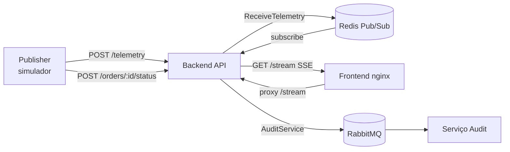

# Arquitetura do sistema

## Visão geral

Plataforma de rastreamento de entregas em tempo real organizada como **monorepo**
com serviços independentes. Cada serviço segue **Arquitetura Limpa** (Ports and
Adapters).



## Estrutura do repositório

```
gps-tracking-SSE/
├── shared/                          # Contratos entre serviços
│   └── src/audit/
├── services/
│   ├── backend/
│   │   └── src/
│   │       ├── domain/
│   │       ├── application/
│   │       ├── infrastructure/
│   │       ├── interfaces/http/
│   │       └── main/
│   ├── audit/
│   │   └── src/
│   │       ├── domain/
│   │       ├── application/
│   │       ├── infrastructure/
│   │       └── main/
│   └── publisher/
│       └── src/
│           ├── domain/
│           ├── application/
│           ├── infrastructure/
│           └── main/
└── frontend/
    ├── index.html
    └── nginx.conf
```

## Componentes

| Componente | Responsabilidade | Tecnologia |
| --- | --- | --- |
| `backend` | API HTTP, cálculo de distância, Redis Pub/Sub e SSE | Node.js, Express, TypeScript |
| `audit` | Consome e registra eventos de status | Node.js, AMQP |
| `publisher` | Simula rotas e envia telemetria | Node.js, OSRM |
| `frontend` | Dashboard com mapa em tempo real | HTML, Leaflet, nginx |
| `shared` | Tipos e constantes de auditoria | TypeScript |

## Camadas por serviço

### Backend

| Camada | Conteúdo |
| --- | --- |
| `domain` | `Telemetry`, `CarMovement` |
| `application` | `ReceiveTelemetry`, `StreamCarMovements`, `UpdateOrderStatus` |
| `application/ports` | `CarMovementPublisher`, `CarMovementSubscriber`, `AuditService` |
| `infrastructure` | `RedisCarMovementPublisher`, `AmqpAuditService` |
| `interfaces/http` | Controllers Express e rotas |

### Audit

| Camada | Conteúdo |
| --- | --- |
| `domain` | `OrderStatusAudit` (reexportado de `shared`) |
| `application` | `RecordOrderStatusAudit` |
| `application/ports` | `AuditEventWriter` |
| `infrastructure` | `AmqpOrderStatusConsumer`, `ConsoleAuditEventWriter` |

### Publisher

| Camada | Conteúdo |
| --- | --- |
| `domain` | `RouteConfig`, `TelemetryPayload` |
| `application` | `SimulateDeliveryRoutes` |
| `application/ports` | `RouteProvider`, `TelemetrySender` |
| `infrastructure` | `OsrmRouteProvider`, `HttpTelemetrySender` |

## Fluxos

### Telemetria e rastreamento

1. O `publisher` envia `POST /telemetry` ao `backend`.
2. `ReceiveTelemetry` calcula `remainingDistanceKm` (Haversine) e publica no Redis.
3. `StreamCarMovements` assina o canal e entrega via SSE em `GET /stream`.
4. O `frontend` (nginx) faz proxy de `/stream` para o backend e atualiza o mapa.

### Auditoria de status

1. `POST /orders/:orderId/status` invoca `UpdateOrderStatus`.
2. `AmqpAuditService` publica na fila durável `audit.order-status`.
3. O serviço `audit` consome, valida com `RecordOrderStatusAudit` e registra.

## Resiliência

- Redis Pub/Sub é volátil — adequado para telemetria visual.
- AMQP é durável — adequado para auditoria.
- Healthcheck do backend em `GET /health`.
- Frontend separado evita acoplar UI à API.
