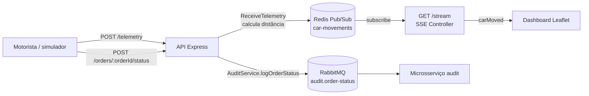

# Arquitetura do sistema

## Visão geral

Esta é uma plataforma de rastreamento de entregas em tempo real. O motorista
(ou o simulador local) envia telemetria para a API. A aplicação calcula a
distância restante, publica a atualização no Redis e a repassa ao mapa por
Server-Sent Events (SSE). Alterações relevantes de status são enviadas ao
microsserviço de auditoria por AMQP.



## Componentes

| Componente | Responsabilidade | Tecnologia |
| --- | --- | --- |
| `app` | API HTTP, cálculo de distância, publicação Redis e streaming SSE | Node.js, Express, TypeScript |
| `publisher` | Simula rotas e envia telemetria para a API | Node.js, OSRM |
| `redis` | Distribui atualizações transitórias de posição | Redis Pub/Sub |
| `audit` | Consome eventos de auditoria | Node.js, AMQP |
| `rabbitmq` | Fila durável de auditoria | RabbitMQ |
| Dashboard | Exibe mapa, posição, trajeto percorrido e distância | HTML, JavaScript, Leaflet |

Os serviços são definidos em `back/docker-compose.yml`. O dashboard é servido
pela própria API em `http://localhost:8080/`.

## Fluxos

### Telemetria e rastreamento

1. O cliente envia `POST /telemetry` com identificadores, posição atual e
   destino.
2. `TelemetryController` valida o payload e chama `ReceiveTelemetry`.
3. O caso de uso calcula `remainingDistanceKm` pela fórmula de Haversine. É
   uma distância geodésica em linha reta, não a distância viária do OSRM.
4. `RedisCarMovementPublisher` serializa o evento e o publica no canal
   `car-movements`.
5. Para cada conexão `GET /stream`, `RedisCarMovementSubscriber` assina o
   canal e `StreamCarMovementsController` envia o evento SSE `carMoved`.
6. O dashboard lê `position.lat`, `position.lng` e
   `remainingDistanceKm`, move o marcador, acrescenta o ponto à linha e
   atualiza o indicador em quilômetros.

Payload aceito em `POST /telemetry`:

```json
{
  "orderId": "order-42",
  "driverId": "driver-7",
  "lat": -21.7545,
  "lng": -41.3245,
  "destinationLat": -21.7681,
  "destinationLng": -41.3392
}
```

Evento publicado e enviado via SSE:

```json
{
  "orderId": "order-42",
  "driverId": "driver-7",
  "position": { "lat": -21.7545, "lng": -41.3245 },
  "destination": { "lat": -21.7681, "lng": -41.3392 },
  "remainingDistanceKm": 2.143,
  "receivedAt": "2026-08-05T17:50:35.184Z"
}
```

### Auditoria de status

1. O motorista chama `POST /orders/:orderId/status` com `driverId` e um
   status.
2. `UpdateOrderStatus` depende apenas da porta `AuditService` e invoca
   `logOrderStatus`.
3. `AmqpAuditService` publica uma mensagem persistente na fila
   `audit.order-status`.
4. O processo `src/audit/main.ts` consome, registra e confirma (`ack`) a
   mensagem. Uma mensagem inválida é rejeitada sem reenvio (`nack`).

Os status canônicos são `ARRIVED_AT_LOCATION` e `DELIVERED`. Os aliases
`CHEGOU_NO_LOCAL` e `ENTREGUE` são aceitos pela API.

## Organização do código

O backend segue Ports and Adapters (Clean Architecture):

- `back/src/domain`: entidades de telemetria e movimentação;
- `back/src/application/use-cases`: regras `ReceiveTelemetry`,
  `StreamCarMovements` e `UpdateOrderStatus`;
- `back/src/application/ports`: contratos para Redis e auditoria;
- `back/src/infrastructure`: adaptadores Redis e AMQP;
- `back/src/interfaces/http`: rotas, controllers e SSE;
- `back/src/audit`: processo independente consumidor de auditoria.

Assim, os casos de uso não dependem de Express, Redis ou RabbitMQ e os
adaptadores podem ser substituídos sem alterar a regra de negócio.

## Resiliência e limites atuais

- Redis Pub/Sub é propositalmente volátil: uma posição pode ser perdida se
  não houver assinante, mas a próxima atualização substitui a anterior no
  mapa.
- A fila AMQP é durável e as mensagens de status são persistentes, pois
  auditoria exige maior confiabilidade que telemetria visual.
- Os healthchecks do Compose verificam Redis, RabbitMQ e a rota HTTP da API;
  `publisher` só inicia após o `app` estar saudável.
- A distância exibida é uma aproximação geodésica. Para distância por ruas,
  o caso de uso deve consultar um serviço de roteamento e tratar latência,
  custo e indisponibilidade.
