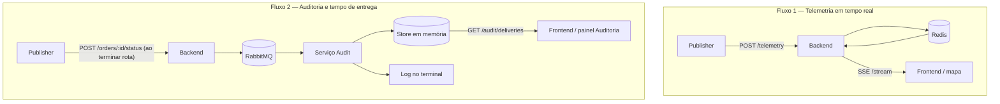

# Fluxo completo da aplicação (guia para iniciantes)

Este documento explica **do zero** como o sistema de rastreamento funciona.
A ideia é que você consiga abrir o projeto, rodar com Docker e entender
**quem fala com quem**, **em que ordem** e **por quê**.

Se algo parecer difícil, leia com calma: o sistema parece grande, mas na
prática são **dois fluxos principais** que convivem no mesmo monorepo.

---

## O que este sistema faz?

Imagine uma empresa de entregas. Um entregador anda de moto pela cidade e o
escritório quer ver **em tempo real** onde ele está no mapa.

Este projeto simula isso:

1. Um **simulador** (`publisher`) finge ser o entregador e manda a posição GPS.
2. O **backend** recebe, calcula a distância até o destino e repassa para quem
   estiver ouvindo.
3. O **frontend** (navegador) mostra um mapa com um ícone de moto se movendo.

Além disso, existe um segundo fluxo **separado** para **auditoria**: quando uma
rota termina, o simulador avisa que o pedido foi **entregue**, registrando o
**tempo total da rota**. Esse dado passa pelo RabbitMQ, é guardado pelo serviço
`audit` e aparece no **painel de Auditoria** do frontend — provando que o fluxo
durável está funcionando.

---

## Visão geral: quem são os personagens?

| Personagem | Pasta | O que faz, em uma frase |
| --- | --- | --- |
| **Publisher** | `services/publisher/` | Simula o entregador, envia telemetria e avisa entregas |
| **Backend** | `services/backend/` | Porta de entrada HTTP: valida, calcula e distribui dados |
| **Frontend** | `frontend/` | Mapa ao vivo + painel de entregas auditadas |
| **Audit** | `services/audit/` | Consome fila AMQP, guarda eventos e expõe API de leitura |
| **Shared** | `shared/` | Tipos e constantes usados por mais de um serviço |
| **Redis** | Docker | "Rádio" rápido para telemetria em tempo real |
| **RabbitMQ** | Docker | "Correio" confiável para eventos de auditoria |

Quando você roda `docker compose up`, todos esses personagens sobem juntos.

---

## Os dois fluxos (muito importante entender isso)

O sistema **não é um fluxo só**. São **dois caminhos diferentes** com objetivos
diferentes:



### Fluxo 1 — Telemetria (mapa ao vivo)

- **Objetivo:** mostrar onde o entregador está **agora**.
- **Velocidade:** precisa ser rápido.
- **Pode perder um ponto?** Sim, aceitável — a próxima posição substitui a
  anterior.
- **Tecnologia:** Redis Pub/Sub + SSE.

### Fluxo 2 — Auditoria (tempo de entrega)

- **Objetivo:** registrar que a entrega terminou e **quanto tempo a rota levou**.
- **Velocidade:** pode ser um pouco mais lento.
- **Pode perder?** **Não** — precisa ser durável.
- **Tecnologia:** RabbitMQ (fila persistente) + store em memória no audit (demo).

> **Analogia simples:** telemetria é como uma transmissão ao vivo de rádio
> (se você perder um segundo, o próximo já corrige). Auditoria é como guardar
> um comprovante numa gaveta (não pode sumir).

---

## Fluxo 1 passo a passo: do simulador até o mapa

### Passo 0 — Tudo começa quando o Docker sobe

Ordem aproximada de inicialização:

1. **Redis** e **RabbitMQ** ficam prontos (healthcheck).
2. **Backend** conecta no Redis e RabbitMQ, abre a porta `8080`.
3. **Audit** conecta no RabbitMQ, abre API HTTP na porta `8081` e fica
   esperando mensagens.
4. **Publisher** espera o backend estar saudável e começa a simular.
5. **Frontend** (nginx) serve a página na porta `3000` e faz proxy de `/stream`
   e `/audit/`.

### Passo 1 — O publisher escolhe uma rota

Arquivo principal: `services/publisher/src/main/main.ts`

O simulador tem **5 rotas** em Campos dos Goytacazes (RJ). Para cada rota,
ele pede ao **OSRM** (serviço externo de mapas) uma lista de coordenadas que
formam o caminho pelas ruas.

Depois, a cada **1,5 segundo** (configurável), ele avança um ponto nessa lista.
Ao **iniciar** uma rota, ele grava `routeStartedAt = Date.now()` — isso será
usado depois para calcular o tempo de entrega.

### Passo 2 — O publisher envia HTTP para o backend

Arquivo: `services/publisher/src/infrastructure/http/http-telemetry-sender.ts`

Ele faz um `POST` para `/telemetry` com um JSON assim:

```json
{
  "orderId": "simulated-order-1",
  "driverId": "simulated-driver-1",
  "lat": -21.7545,
  "lng": -41.3245,
  "destinationLat": -21.7681,
  "destinationLng": -41.3392
}
```

**Por que `orderId`?** Cada rota simulada usa um pedido diferente
(`simulated-order-1`, `simulated-order-2`, …). O frontend usa isso para saber
quando começou uma rota nova no mapa.

> O publisher **nunca** fala direto com o Redis. Isso é de propósito: todo dado
> passa pelo backend para ser validado e enriquecido.

### Passo 3 — O backend recebe e valida

Arquivo: `services/backend/src/interfaces/http/controllers/telemetry-controller.ts`

O controller verifica:

- `orderId` e `driverId` são strings não vazias
- `lat`, `lng`, `destinationLat`, `destinationLng` são números válidos
- coordenadas estão dentro dos limites do planeta (lat ±90, lng ±180)

Se algo estiver errado → resposta **400**. Se estiver ok → segue para o caso
de uso.

### Passo 4 — O backend calcula a distância restante

Arquivo: `services/backend/src/application/use-cases/receive-telemetry.ts`

O caso de uso `ReceiveTelemetry`:

1. Calcula `remainingDistanceKm` com a fórmula de **Haversine** (distância em
   linha reta entre dois pontos na Terra).
2. Adiciona `receivedAt` (horário ISO em que o backend recebeu).
3. Monta o objeto `TelemetryUpdate` (telemetria + campos extras).

Exemplo do que sai:

```json
{
  "orderId": "simulated-order-1",
  "driverId": "simulated-driver-1",
  "position": { "lat": -21.7545, "lng": -41.3245 },
  "destination": { "lat": -21.7681, "lng": -41.3392 },
  "remainingDistanceKm": 1.876,
  "receivedAt": "2026-08-06T18:00:00.000Z"
}
```

### Passo 5 — Publicação no Redis

Arquivo: `services/backend/src/infrastructure/redis/redis-car-movement-publisher.ts`

O backend publica esse JSON no canal Redis chamado `car-movements`.

Pense no Redis aqui como um **alto-falante**: quem estiver ouvindo o canal
recebe a mensagem na hora.

### Passo 6 — O backend escuta o próprio Redis e manda SSE

Dois arquivos importantes:

- `services/backend/src/infrastructure/redis/redis-car-movement-subscriber.ts`
  — assina o canal
- `services/backend/src/interfaces/http/controllers/stream-car-movement-controller.ts`
  — envia para o navegador

Quando alguém abre `GET /stream`, acontece o seguinte:

1. A conexão HTTP **fica aberta** (não é uma resposta normal que fecha).
2. Cada movimento do Redis vira uma linha SSE no formato:

```
event: carMoved
data: {"orderId":"simulated-order-1", ...}

```

3. A cada 30 segundos, manda `: keep-alive` para a conexão não cair.

**O que é SSE?** Server-Sent Events. É um jeito do servidor **empurrar** dados
para o navegador, só em uma direção (servidor → cliente). No JavaScript, usamos
`new EventSource("/stream")`.

### Passo 7 — O nginx repassa o stream

Arquivo: `frontend/nginx.conf`

O navegador acessa `http://localhost:3000/stream`, mas quem responde de verdade
é o backend na porta `8080`. O nginx faz **proxy** e desliga o buffering (senão
o mapa ficaria "atrasado").

### Passo 8 — O frontend desenha no mapa

Arquivo: `frontend/index.html`

Quando chega um evento `carMoved`:

1. Faz `JSON.parse` do `data`.
2. Se o `orderId` mudou → inicia uma **nova trilha colorida** no mapa (a
   anterior fica mais transparente).
3. Move o marcador 🛵 para `position.lat` / `position.lng`.
4. Atualiza a sidebar esquerda: coordenadas, distância, horário, status da
   conexão.

Biblioteca do mapa: **Leaflet**.

---

## Fluxo 2 passo a passo: auditoria e tempo de entrega

Este fluxo **não usa o mapa em tempo real**. É independente da telemetria.
Ele começa quando o simulador **termina todos os pontos de uma rota**.

### Visão geral em 10 passos

```
[1]  Publisher termina todos os pontos da rota
         ↓
[2]  Calcula durationMs = agora − routeStartedAt
         ↓
[3]  POST /orders/simulated-order-N/status  (HTTP)
         ↓
[4]  Backend — OrderStatusController valida
         ↓
[5]  UpdateOrderStatus monta OrderStatusAudit (+ occurredAt)
         ↓
[6]  AmqpAuditService publica na fila audit.order-status (RabbitMQ)
         ↓
[7]  Audit — AmqpOrderStatusConsumer recebe a mensagem
         ↓
[8]  RecordOrderStatusAudit valida e grava (log + store em memória)
         ↓
[9]  Frontend — SSE /audit/stream (via nginx, evento deliveryRecorded)
         ↓
[10] Painel Auditoria exibe pedido, tempo, rota e horário
```

---

### Passo 1 — O simulador detecta que a rota acabou

Arquivo: `services/publisher/src/application/use-cases/simulate-delivery-routes.ts`

A cada 1,5 s o simulador avança `stepIndex`. Quando `stepIndex` chega ao
**tamanho da lista de coordenadas**, significa que todos os pontos da rota
foram percorridos — a entrega simulada terminou.

Nesse momento **antes** de trocar para a próxima rota, entra o fluxo de
auditoria.

---

### Passo 2 — Cálculo do tempo da rota

Ainda no `simulate-delivery-routes.ts`:

```javascript
durationMs = Date.now() - routeStartedAt
```

| Variável | Quando é definida | O que guarda |
| --- | --- | --- |
| `routeStartedAt` | Ao iniciar cada rota (primeira ou após troca) | Timestamp do início |
| `durationMs` | Ao terminar a rota | Quanto tempo durou, em milissegundos |

Exemplo: se a rota começou às 21:00:00 e terminou às 21:03:04, então
`durationMs = 184000` (3 minutos e 4 segundos).

Esse valor é enviado **pelo publisher** — ele é quem cronometrou a rota.

---

### Passo 3 — Publisher avisa o backend

Arquivo: `services/publisher/src/infrastructure/http/http-order-status-notifier.ts`

O simulador faz um `POST` para:

```
POST /orders/simulated-order-1/status
```

Corpo enviado:

```json
{
  "driverId": "simulated-driver-1",
  "status": "DELIVERED",
  "routeName": "IFF Centro -> Boulevard Shopping",
  "durationMs": 184500
}
```

| Campo | Quem preenche | Significado |
| --- | --- | --- |
| `driverId` | Publisher | Motorista simulado |
| `status` | Publisher | Sempre `DELIVERED` ao concluir rota |
| `routeName` | Publisher | Nome legível da rota (das 5 definidas em `main.ts`) |
| `durationMs` | Publisher | Tempo total da rota em milissegundos |

Variável de ambiente do publisher: `ORDER_STATUS_BASE_URL` (padrão
`http://backend:8080`).

Se essa chamada falhar, o simulador loga erro mas **continua** para a próxima
rota — a telemetria não para.

---

### Passo 4 — Backend valida a requisição

Arquivo: `services/backend/src/interfaces/http/controllers/order-status-controller.ts`

O controller verifica:

- `orderId` na URL é string não vazia
- `driverId` é string não vazia
- `status` é `DELIVERED`, `ARRIVED_AT_LOCATION` ou alias em português
  (`ENTREGUE`, `CHEGOU_NO_LOCAL`)
- `routeName`, se enviado, é string
- `durationMs`, se enviado, é número finito ≥ 0

Erro de validação → **400**. Sucesso → chama o caso de uso.

---

### Passo 5 — Backend monta o evento de auditoria

Arquivo: `services/backend/src/application/use-cases/update-order-status.ts`

O caso de uso `UpdateOrderStatus` junta tudo num objeto `OrderStatusAudit`:

```json
{
  "orderId": "simulated-order-1",
  "driverId": "simulated-driver-1",
  "status": "DELIVERED",
  "occurredAt": "2026-08-06T21:03:04.500Z",
  "routeName": "IFF Centro -> Boulevard Shopping",
  "durationMs": 184500
}
```

**Atenção à diferença de responsabilidades:**

| Campo | Quem define | Por quê |
| --- | --- | --- |
| `durationMs` | Publisher (via HTTP) | Só quem percorreu a rota sabe quanto levou |
| `occurredAt` | Backend (`new Date().toISOString()`) | Carimbo oficial do servidor no momento do registro |
| `routeName` | Publisher | Descrição amigável da rota simulada |
| `orderId` | URL do POST | Identificador do pedido |

O `occurredAt` é o **horário da entrega registrada**. O `durationMs` é o
**tempo que a rota levou**. Os dois juntos formam o registro de tempo de
entrega.

---

### Passo 6 — Publicação durável no RabbitMQ

Arquivo: `services/backend/src/infrastructure/amqp/amqp-audit-service.ts`

O adaptador `AmqpAuditService`:

1. Conecta no RabbitMQ (`AUDIT_AMQP_URL`).
2. Garante que a fila `audit.order-status` existe (`durable: true`).
3. Envia o JSON com flag **`persistent: true`** — a mensagem sobrevive a
   reinício do broker.

Nome da fila definido em `shared/src/audit/constants.ts`:

```typescript
export const AUDIT_ORDER_STATUS_QUEUE = 'audit.order-status';
```

**Por que RabbitMQ e não Redis?** Redis Pub/Sub apagaria a mensagem se ninguém
estivesse ouvindo na hora. Na auditoria, **perder um evento de entrega é
inaceitável**.

---

### Passo 7 — Serviço audit consome a fila

Arquivo: `services/audit/src/infrastructure/amqp/amqp-order-status-consumer.ts`

O audit roda **em paralelo** ao backend. Ele:

1. Conecta no mesmo RabbitMQ.
2. Assina a fila `audit.order-status`.
3. Para cada mensagem, faz `JSON.parse` → `OrderStatusAudit`.
4. Chama `RecordOrderStatusAudit.execute(event)`.
5. Se deu certo → `ack` (confirma leitura). Se deu erro → `nack`.

Isso garante que cada entrega seja processada **exatamente uma vez** pelo
consumidor (desde que o processamento funcione).

---

### Passo 8 — Gravação: log + store em memória

Arquivos:

- `services/audit/src/application/use-cases/record-order-status-audit.ts`
- `services/audit/src/infrastructure/logging/console-audit-event-writer.ts`
- `services/audit/src/infrastructure/storage/in-memory-audit-event-store.ts`

O caso de uso `RecordOrderStatusAudit`:

1. Valida campos obrigatórios (`orderId`, `driverId`, `occurredAt`).
2. Escreve no **terminal** via `ConsoleAuditEventWriter`:

```
[audit.order-status] {"orderId":"simulated-order-1","status":"DELIVERED",...}
```

3. Guarda no **store em memória** via `InMemoryAuditEventStore.append(event)`.

> **Importante:** o store em memória é para **demonstração**. Se reiniciar o
> container `audit`, o histórico some. Em produção, trocaria por banco de dados.
> O RabbitMQ, porém, **já é durável** — a mensagem não se perde se o audit
> estiver temporariamente offline.

---

### Passo 9 — API de leitura do audit

Arquivo: `services/audit/src/interfaces/http/create-audit-http-server.ts`

O serviço audit expõe HTTP na porta `8081`:

| Rota | Método | Resposta |
| --- | --- | --- |
| `/health` | GET | `{ "status": "ok" }` |
| `/audit/deliveries` | GET | Lista de entregas (`status: DELIVERED`), mais recentes primeiro |

Exemplo de resposta de `/audit/deliveries`:

```json
[
  {
    "orderId": "simulated-order-2",
    "driverId": "simulated-driver-1",
    "status": "DELIVERED",
    "occurredAt": "2026-08-06T21:08:15.200Z",
    "routeName": "Rodoviária Roberto Silveira -> IFF Centro",
    "durationMs": 156000
  },
  {
    "orderId": "simulated-order-1",
    "driverId": "simulated-driver-1",
    "status": "DELIVERED",
    "occurredAt": "2026-08-06T21:03:04.500Z",
    "routeName": "IFF Centro -> Boulevard Shopping",
    "durationMs": 184500
  }
]
```

O nginx repassa `http://localhost:3000/audit/deliveries` →
`http://audit:8081/audit/deliveries` (ver `frontend/nginx.conf`).

---

### Passo 10 — Frontend exibe o painel de Auditoria

Arquivo: `frontend/index.html`

No canto **direito** da tela há o painel **📋 Auditoria**. Ele usa
`EventSource("/audit/stream")` — a mesma tecnologia SSE do mapa. Ao conectar,
recebe o histórico de entregas; cada nova entrega chega no evento
`deliveryRecorded`:

```javascript
const auditEs = new EventSource("/audit/stream");
auditEs.addEventListener("deliveryRecorded", (e) => {
  const delivery = JSON.parse(e.data);
  // atualiza o painel imediatamente
});
```

Para cada entrega registrada, mostra:

| Na tela | Vem do campo | Exemplo |
| --- | --- | --- |
| Nome do pedido | `orderId` | `simulated-order-1` |
| Tempo da rota | `durationMs` | `3m 4s` |
| Nome da rota | `routeName` | `IFF Centro -> Boulevard Shopping` |
| Horário do registro | `occurredAt` | `21:03:04` |

O contador **Entregas registradas** reflete quantos eventos `DELIVERED` o audit
guardou. Se o badge **Serviço** estiver **Online** (verde), a API do audit
está respondendo.

**Isso prova que o fluxo funciona de ponta a ponta:** publisher → backend →
RabbitMQ → audit → store → frontend.

---

## Quando o simulador troca de rota (telemetria + auditoria juntos)

Arquivo: `services/publisher/src/application/use-cases/simulate-delivery-routes.ts`

Quando o entregador simulado chega ao fim dos pontos de uma rota, **nesta ordem**:

1. **Calcula** `durationMs` desde `routeStartedAt`.
2. **Registra entrega** — `POST /orders/:orderId/status` com `DELIVERED`
   (fluxo 2 completo).
3. **Escolhe** outra rota aleatória (diferente da atual).
4. **Busca** coordenadas OSRM da nova rota.
5. **Reinicia** `stepIndex = 0` e `routeStartedAt = Date.now()`.
6. **Volta** a mandar telemetria com novo `orderId` (fluxo 1).

No frontend:

- **Mapa (esquerda):** mudança de `orderId` → nova trilha colorida.
- **Auditoria (direita):** nova linha aparece após a rota terminar, com o tempo.

No terminal do **publisher**:

```
[Auditoria] simulated-order-1 entregue em 184.5s — IFF Centro -> Boulevard Shopping
```

---

## Como as pastas se organizam (Clean Architecture simplificada)

Cada serviço em `services/` segue a mesma ideia de camadas:

```
domain/          → "O que é?" (entidades puras, sem Express, sem Redis)
application/     → "O que fazer?" (casos de uso + interfaces/portas)
infrastructure/  → "Como fazer de verdade?" (Redis, AMQP, HTTP, OSRM)
interfaces/      → "Como o mundo externo entra?" (controllers HTTP)
main/            → "Ligar tudo" (main.ts monta as dependências)
```

**Exemplo concreto no fluxo de auditoria:**

| Camada | Serviço | Arquivo | Papel |
| --- | --- | --- | --- |
| application | publisher | `simulate-delivery-routes.ts` | Detecta fim da rota, cronometra |
| application/ports | publisher | `order-status-notifier.ts` | Contrato "avisar entrega" |
| infrastructure | publisher | `http-order-status-notifier.ts` | POST HTTP de verdade |
| interfaces | backend | `order-status-controller.ts` | Recebe POST e valida |
| application | backend | `update-order-status.ts` | Monta evento + occurredAt |
| infrastructure | backend | `amqp-audit-service.ts` | Publica no RabbitMQ |
| infrastructure | audit | `amqp-order-status-consumer.ts` | Consome a fila |
| application | audit | `record-order-status-audit.ts` | Valida e persiste |
| infrastructure | audit | `in-memory-audit-event-store.ts` | Guarda para consulta |
| interfaces | audit | `create-audit-http-server.ts` | Expõe GET /audit/deliveries |

**Trilha para debugar auditoria:**

```
Publisher (fim de rota)
  → POST /orders/:id/status
  → OrderStatusController
  → UpdateOrderStatus
  → AmqpAuditService
  → RabbitMQ
  → AmqpOrderStatusConsumer
  → RecordOrderStatusAudit
  → ConsoleAuditEventWriter + InMemoryAuditEventStore
  → SSE /audit/stream (event: deliveryRecorded)
  → Frontend (painel Auditoria)
```

---

## O pacote `shared`

Pasta: `shared/src/audit/`

Guarda contratos que **backend** e **audit** precisam concordar:

- `OrderStatus` — `'ARRIVED_AT_LOCATION' | 'DELIVERED'`
- `OrderStatusAudit` — formato do evento de auditoria
- `AUDIT_ORDER_STATUS_QUEUE` — nome da fila (`audit.order-status`)

Formato completo de `OrderStatusAudit`:

```typescript
interface OrderStatusAudit {
  orderId: string;
  driverId: string;
  status: OrderStatus;
  occurredAt: string;      // ISO — carimbo do backend
  routeName?: string;      // opcional — enviado pelo simulador
  durationMs?: number;     // opcional — tempo da rota em ms
}
```

Assim ninguém "inventa" nomes diferentes em cada serviço.

---

## Linha do tempo: telemetria a cada 1,5 s

```
[Publisher]  avança coordenada na rota OSRM
     ↓
[Publisher]  POST /telemetry  (HTTP)
     ↓
[Backend]    valida + Haversine + receivedAt
     ↓
[Backend]    PUBLISH no Redis (canal car-movements)
     ↓
[Backend]    subscriber recebe → escreve no SSE /stream
     ↓
[Nginx]      repassa para o navegador
     ↓
[Frontend]   EventSource dispara → mapa atualiza
```

Isso se repete **a cada passo** enquanto a rota estiver em andamento.

---

## Linha do tempo: auditoria ao fim de cada rota

```
[Publisher]  stepIndex >= total de pontos (rota terminou)
     ↓
[Publisher]  durationMs = Date.now() - routeStartedAt
     ↓
[Publisher]  POST /orders/simulated-order-N/status
     ↓
[Backend]    valida + occurredAt + publica RabbitMQ
     ↓
[Audit]      consome fila → valida → log + store
     ↓
[Frontend]   EventSource /audit/stream → painel atualiza
     ↓
[Publisher]  escolhe nova rota, reinicia cronômetro
```

Isso acontece **uma vez por rota concluída** (não a cada 1,5 s).

---

## Glossário rápido

| Termo | Significado simples |
| --- | --- |
| **Telemetria** | Dados de posição (GPS) enviados periodicamente |
| **SSE** | Conexão HTTP aberta onde o servidor envia eventos ao navegador |
| **Pub/Sub** | Publicar num canal; quem assina recebe (Redis) |
| **Fila (Queue)** | Caixa de mensagens; consumidor processa uma a uma (RabbitMQ) |
| **Proxy** | nginx recebe a requisição e repassa para outro servidor |
| **Caso de uso** | Uma ação de negócio ("receber telemetria", "registrar entrega") |
| **Porta (interface)** | Contrato abstrato; a implementação real fica na infrastructure |
| **Haversine** | Fórmula matemática para distância entre dois pontos na Terra |
| **Monorepo** | Vários projetos/serviços no mesmo repositório Git |
| **durationMs** | Tempo total da rota, do início ao fim, em milissegundos |
| **occurredAt** | Timestamp ISO de quando o backend registrou o evento |
| **DELIVERED** | Status de pedido entregue — dispara o fluxo de auditoria |

---

## Como testar e "ver" o fluxo com seus olhos

### 1. Subir tudo

```bash
docker compose up
```

### 2. Abrir o dashboard

Navegador: http://localhost:3000

- **Esquerda:** mapa com moto se movendo.
- **Direita:** painel Auditoria (pode começar vazio).

### 3. Aguardar uma rota terminar

Depende do tamanho da rota OSRM × 1,5 s por passo. Quando terminar:

- Painel Auditoria ganha uma linha com tempo (ex.: `3m 4s`).
- Contador **Entregas registradas** sobe.
- Log do **publisher**: `[Auditoria] simulated-order-1 entregue em ...`
- Log do **audit**: `[audit.order-status] {...}`

### 4. Ver logs do publisher (telemetria)

```
[Rota 1 - Passo 15/120] Telemetria enviada.
```

### 5. Testar telemetria manualmente

```bash
curl -X POST http://localhost:8080/telemetry \
  -H "Content-Type: application/json" \
  -d "{\"orderId\":\"teste-1\",\"driverId\":\"dev-1\",\"lat\":-21.75,\"lng\":-41.32,\"destinationLat\":-21.76,\"destinationLng\":-41.33}"
```

Se o mapa estiver aberto, deve reagir. **Isso não gera auditoria** — só
telemetria.

### 6. Testar auditoria manualmente

```bash
curl -X POST http://localhost:8080/orders/pedido-manual-1/status \
  -H "Content-Type: application/json" \
  -d "{\"driverId\":\"dev-1\",\"status\":\"DELIVERED\",\"routeName\":\"Teste manual\",\"durationMs\":120000}"
```

Em seguida deve aparecer no painel Auditoria (via SSE). Log do container `audit`
confirma o registro.

### 7. Consultar API do audit diretamente

```bash
curl http://localhost:8081/audit/deliveries
```

Ou via nginx: `curl http://localhost:3000/audit/deliveries`

### 8. Inspecionar SSE no navegador

DevTools → aba **Network** → filtrar por `stream` → ver eventos chegando.

DevTools → filtrar por `audit/stream` → ver eventos SSE chegando.

---

## Perguntas que juniors costumam ter

### "Por que não mandar direto do publisher para o frontend?"

Porque o backend precisa **validar** e **calcular** a distância. Se cada
cliente fizesse isso, teríamos resultados diferentes e regras espalhadas.

### "Por que Redis E RabbitMQ? Não dá para usar só um?"

Dá, mas seria escolher um compromisso ruim:

- Redis Pub/Sub é rápido, mas **não guarda** mensagens para depois.
- RabbitMQ é mais lento, mas **persiste** — ideal para auditoria.

### "O frontend chama POST /telemetry?"

**Não.** O frontend só **escuta** `/stream` (mapa) e **consulta**
`/audit/deliveries` (painel). Quem envia posição é o publisher.

### "O simulador avisa o audit ao terminar a rota?"

**Sim.** Antes de trocar de rota, ele chama `POST /orders/:orderId/status`
com `DELIVERED`, `routeName` e `durationMs`.

### "Qual a diferença entre durationMs e occurredAt?"

- `durationMs` — **quanto tempo a rota levou** (cronômetro do publisher).
- `occurredAt` — **em que instante o backend registrou** a entrega (relógio
  do servidor).

Os dois juntos formam o registro de tempo de entrega.

### "Se eu reiniciar o Redis, perco o quê?"

Mensagens em trânsito de telemetria. O mapa pode "pular" um ponto, mas o
simulador manda outro em 1,5 s.

### "Se eu reiniciar o audit, perco o quê?"

O **histórico em memória** do painel (store). As mensagens **já processadas**
estão confirmadas no RabbitMQ. Mensagens **não consumidas** ainda esperam na
fila.

### "Onde mudo o intervalo da simulação?"

Variável de ambiente `SIMULATION_INTERVAL_MS` (padrão `1500` ms) no publisher.

### "Por que SSE no painel de auditoria e não polling?"

Polling (`fetch` a cada N segundos) era a primeira versão, mas tem dois
problemas: atraso de até N segundos e requisições repetidas mesmo sem novidade.
SSE encaixa melhor porque entregas são eventos esparsos (fim de rota) e o
audit já notifica cada registro em tempo real via `deliveryRecorded`.

### "Consultei localhost:8080 e veio [] — é bug?"

A lista de entregas **não fica no backend**. Quem expõe é o serviço **audit** na
porta `8081` (`GET /audit/deliveries` ou SSE `GET /audit/stream`). Via nginx:
`http://localhost:3000/audit/...`.

---

## Mapa mental final

```
Você (navegador)
    ↑ SSE /stream (mapa ao vivo)
    ↑ SSE /audit/stream (painel entregas, tempo real)
    │
  nginx :3000
    │                    ↘
  backend :8080          audit :8081
    ↑ POST /telemetry       ↑ GET /audit/deliveries
    ↑ POST /orders/.../status
    │         │
  publisher   RabbitMQ ──→ audit (consome fila)
    │
  OSRM (rotas)

  backend ←→ Redis (telemetria volátil)
  backend → RabbitMQ (auditoria durável)
```

---

## Próximos passos sugeridos para estudar o código

1. Leia `services/publisher/src/main/main.ts` — ponto de partida da simulação.
2. Siga `POST /telemetry` até `receive-telemetry.ts` — coração do fluxo 1.
3. Siga fim de rota em `simulate-delivery-routes.ts` →
   `http-order-status-notifier.ts` — gatilho do fluxo 2.
4. Abra `update-order-status.ts` e `amqp-audit-service.ts` — backend → fila.
5. Abra `amqp-order-status-consumer.ts` e `in-memory-audit-event-store.ts` —
   audit guardando o evento.
6. Abra `frontend/index.html` — `EventSource` (mapa) e `refreshAudit()`
   (painel).
7. Leia [architecture.md](architecture.md) para detalhes técnicos e
   [adr.md](adr.md) para entender **por que** cada decisão foi tomada.

Boa leitura — percorrer os dois fluxos com o Docker rodando costuma fazer
clicar tudo de uma vez.
