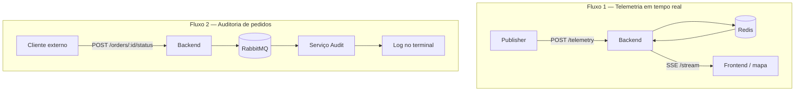

# Fluxo completo da aplicação (guia para iniciantes)

Este documento explica **do zero** como o sistema de rastreamento funciona.
A ideia é que você consiga abrir o projeto, rodar com Docker e entender
**quem fala com quem**, **em que ordem** e **por quê**.

Se algo parecer difícil, leia com calma: o sistema parece grande, mas na
prática são **dois fluxos principais** que convivem no mesmo monorepo.

---

## O que este sistema faz?

Imagine uma empresa de entregas. Um entregador anda de moto pela cidade e o
escritório quer ver **em tempo real** onde ele está no mapa.

Este projeto simula isso:

1. Um **simulador** (`publisher`) finge ser o entregador e manda a posição GPS.
2. O **backend** recebe, calcula a distância até o destino e repassa para quem
   estiver ouvindo.
3. O **frontend** (navegador) mostra um mapa com um ícone de moto se movendo.

Além disso, existe um segundo fluxo **separado** para **auditoria**: quando um
pedido muda de status (chegou no local, foi entregue), isso precisa ser
**registrado com segurança** — não pode se perder como uma posição antiga no
mapa.

---

## Visão geral: quem são os personagens?

| Personagem | Pasta | O que faz, em uma frase |
| --- | --- | --- |
| **Publisher** | `services/publisher/` | Simula o entregador andando por rotas reais |
| **Backend** | `services/backend/` | Porta de entrada HTTP: valida, calcula e distribui dados |
| **Frontend** | `frontend/` | Página com mapa que o usuário abre no navegador |
| **Audit** | `services/audit/` | Escuta eventos importantes e grava no log |
| **Shared** | `shared/` | Tipos e constantes usados por mais de um serviço |
| **Redis** | Docker | "Rádio" rápido para telemetria em tempo real |
| **RabbitMQ** | Docker | "Correio" confiável para eventos de auditoria |

Quando você roda `docker compose up`, todos esses personagens sobem juntos.

---

## Os dois fluxos (muito importante entender isso)

O sistema **não é um fluxo só**. São **dois caminhos diferentes** com objetivos
diferentes:



### Fluxo 1 — Telemetria (mapa ao vivo)

- **Objetivo:** mostrar onde o entregador está **agora**.
- **Velocidade:** precisa ser rápido.
- **Pode perder um ponto?** Sim, aceitável — a próxima posição substitui a
  anterior.
- **Tecnologia:** Redis Pub/Sub + SSE.

### Fluxo 2 — Auditoria (status do pedido)

- **Objetivo:** registrar que algo importante aconteceu (chegou, entregou).
- **Velocidade:** pode ser um pouco mais lento.
- **Pode perder?** **Não** — precisa ser durável.
- **Tecnologia:** RabbitMQ (fila persistente).

> **Analogia simples:** telemetria é como uma transmissão ao vivo de rádio
> (se você perder um segundo, o próximo já corrige). Auditoria é como guardar
> um comprovante numa gaveta (não pode sumir).

---

## Fluxo 1 passo a passo: do simulador até o mapa

### Passo 0 — Tudo começa quando o Docker sobe

Ordem aproximada de inicialização:

1. **Redis** e **RabbitMQ** ficam prontos (healthcheck).
2. **Backend** conecta no Redis e RabbitMQ, abre a porta `8080`.
3. **Audit** conecta no RabbitMQ e fica esperando mensagens.
4. **Publisher** espera o backend estar saudável e começa a simular.
5. **Frontend** (nginx) serve a página na porta `3000`.

### Passo 1 — O publisher escolhe uma rota

Arquivo principal: `services/publisher/src/main/main.ts`

O simulador tem **5 rotas** em Campos dos Goytacazes (RJ). Para cada rota,
ele pede ao **OSRM** (serviço externo de mapas) uma lista de coordenadas que
formam o caminho pelas ruas.

Depois, a cada **1,5 segundo** (configurável), ele avança um ponto nessa lista.

### Passo 2 — O publisher envia HTTP para o backend

Arquivo: `services/publisher/src/infrastructure/http/http-telemetry-sender.ts`

Ele faz um `POST` para `/telemetry` com um JSON assim:

```json
{
  "orderId": "simulated-order-1",
  "driverId": "simulated-driver-1",
  "lat": -21.7545,
  "lng": -41.3245,
  "destinationLat": -21.7681,
  "destinationLng": -41.3392
}
```

**Por que `orderId`?** Cada rota simulada usa um pedido diferente
(`simulated-order-1`, `simulated-order-2`, …). O frontend usa isso para saber
quando começou uma rota nova no mapa.

> O publisher **nunca** fala direto com o Redis. Isso é de propósito: todo dado
> passa pelo backend para ser validado e enriquecido.

### Passo 3 — O backend recebe e valida

Arquivo: `services/backend/src/interfaces/http/controllers/telemetry-controller.ts`

O controller verifica:

- `orderId` e `driverId` são strings não vazias
- `lat`, `lng`, `destinationLat`, `destinationLng` são números válidos
- coordenadas estão dentro dos limites do planeta (lat ±90, lng ±180)

Se algo estiver errado → resposta **400**. Se estiver ok → segue para o caso
de uso.

### Passo 4 — O backend calcula a distância restante

Arquivo: `services/backend/src/application/use-cases/receive-telemetry.ts`

O caso de uso `ReceiveTelemetry`:

1. Calcula `remainingDistanceKm` com a fórmula de **Haversine** (distância em
   linha reta entre dois pontos na Terra).
2. Adiciona `receivedAt` (horário ISO em que o backend recebeu).
3. Monta o objeto `TelemetryUpdate` (telemetria + campos extras).

Exemplo do que sai:

```json
{
  "orderId": "simulated-order-1",
  "driverId": "simulated-driver-1",
  "position": { "lat": -21.7545, "lng": -41.3245 },
  "destination": { "lat": -21.7681, "lng": -41.3392 },
  "remainingDistanceKm": 1.876,
  "receivedAt": "2026-08-06T18:00:00.000Z"
}
```

### Passo 5 — Publicação no Redis

Arquivo: `services/backend/src/infrastructure/redis/redis-car-movement-publisher.ts`

O backend publica esse JSON no canal Redis chamado `car-movements`.

Pense no Redis aqui como um **alto-falante**: quem estiver ouvindo o canal
recebe a mensagem na hora.

### Passo 6 — O backend escuta o próprio Redis e manda SSE

Dois arquivos importantes:

- `services/backend/src/infrastructure/redis/redis-car-movement-subscriber.ts`
  — assina o canal
- `services/backend/src/interfaces/http/controllers/stream-car-movement-controller.ts`
  — envia para o navegador

Quando alguém abre `GET /stream`, acontece o seguinte:

1. A conexão HTTP **fica aberta** (não é uma resposta normal que fecha).
2. Cada movimento do Redis vira uma linha SSE no formato:

```
event: carMoved
data: {"orderId":"simulated-order-1", ...}

```

3. A cada 30 segundos, manda `: keep-alive` para a conexão não cair.

**O que é SSE?** Server-Sent Events. É um jeito do servidor **empurrar** dados
para o navegador, só em uma direção (servidor → cliente). No JavaScript, usamos
`new EventSource("/stream")`.

### Passo 7 — O nginx repassa o stream

Arquivo: `frontend/nginx.conf`

O navegador acessa `http://localhost:3000/stream`, mas quem responde de verdade
é o backend na porta `8080`. O nginx faz **proxy** e desliga o buffering (senão
o mapa ficaria "atrasado").

### Passo 8 — O frontend desenha no mapa

Arquivo: `frontend/index.html`

Quando chega um evento `carMoved`:

1. Faz `JSON.parse` do `data`.
2. Se o `orderId` mudou → inicia uma **nova trilha colorida** no mapa (a
   anterior fica mais transparente).
3. Move o marcador 🛵 para `position.lat` / `position.lng`.
4. Atualiza a sidebar: coordenadas, distância, horário, status da conexão.

Biblioteca do mapa: **Leaflet**.

---

## Fluxo 2 passo a passo: auditoria de status

Este fluxo **não aparece no mapa**. É independente.

### Passo 1 — Alguém avisa que o pedido mudou de status

Endpoint: `POST /orders/:orderId/status`

Corpo:

```json
{
  "driverId": "driver-123",
  "status": "DELIVERED"
}
```

Também aceita em português: `CHEGOU_NO_LOCAL`, `ENTREGUE`.

Quem chama? Pode ser um app do entregador, um painel admin, ou um teste com
`curl`. O **publisher não chama** esse endpoint — ele só manda telemetria.

### Passo 2 — Backend publica no RabbitMQ

Arquivo: `services/backend/src/infrastructure/amqp/amqp-audit-service.ts`

O caso de uso `UpdateOrderStatus` manda a mensagem para a fila durável
`audit.order-status` (nome definido em `shared/src/audit/constants.ts`).

**Por que RabbitMQ e não Redis?** Porque aqui queremos **persistência**. Se o
serviço de audit estiver offline, a mensagem espera na fila.

### Passo 3 — Serviço audit consome a fila

Arquivo: `services/audit/src/infrastructure/amqp/amqp-order-status-consumer.ts`

O audit:

1. Conecta no RabbitMQ.
2. Lê mensagens da fila.
3. Valida o evento (`RecordOrderStatusAudit`).
4. Grava no log via `ConsoleAuditEventWriter` (aparece no terminal do
   container `audit`).

Hoje não existe tela para isso — só log. No futuro poderia ir para banco,
Elasticsearch, etc.

---

## Como as pastas se organizam (Clean Architecture simplificada)

Cada serviço em `services/` segue a mesma ideia de camadas:

```
domain/          → "O que é?" (entidades puras, sem Express, sem Redis)
application/     → "O que fazer?" (casos de uso + interfaces/portas)
infrastructure/  → "Como fazer de verdade?" (Redis, AMQP, HTTP, OSRM)
interfaces/      → "Como o mundo externo entra?" (controllers HTTP — só backend)
main/            → "Ligar tudo" (main.ts monta as dependências)
```

**Exemplo concreto no backend:**

| Camada | Arquivo | Papel |
| --- | --- | --- |
| domain | `telemetry.ts` | Define o que é uma telemetria |
| application | `receive-telemetry.ts` | Regra: calcular distância e publicar |
| application/ports | `car-movement-publisher.ts` | Interface "algo que publica movimento" |
| infrastructure | `redis-car-movement-publisher.ts` | Implementação usando Redis de verdade |
| interfaces | `telemetry-controller.ts` | Recebe HTTP e chama o caso de uso |
| main | `main.ts` | `new ReceiveTelemetry(new RedisCarMovementPublisher(...))` |

**Por que isso importa para você?** Quando for debugar, siga a trilha:

```
HTTP request → controller → use case → adapter (Redis/AMQP)
```

---

## O pacote `shared`

Pasta: `shared/src/audit/`

Guarda contratos que **backend** e **audit** precisam concordar:

- `OrderStatus` — `'ARRIVED_AT_LOCATION' | 'DELIVERED'`
- `OrderStatusAudit` — formato do evento de auditoria
- `AUDIT_ORDER_STATUS_QUEUE` — nome da fila (`audit.order-status`)

Assim ninguém "inventa" nomes diferentes em cada serviço.

---

## Linha do tempo: o que acontece a cada 1,5 s (telemetria)

```
[Publisher]  avança coordenada na rota OSRM
     ↓
[Publisher]  POST /telemetry  (HTTP)
     ↓
[Backend]    valida + Haversine + receivedAt
     ↓
[Backend]    PUBLISH no Redis (canal car-movements)
     ↓
[Backend]    subscriber recebe → escreve no SSE /stream
     ↓
[Nginx]      repassa para o navegador
     ↓
[Frontend]   EventSource dispara → mapa atualiza
```

Tudo isso se repete enquanto o simulador estiver rodando.

---

## Quando o simulador troca de rota

Arquivo: `services/publisher/src/application/use-cases/simulate-delivery-routes.ts`

Quando o entregador simulado chega ao fim dos pontos de uma rota:

1. Escolhe **outra rota aleatória** (diferente da atual).
2. Busca coordenadas OSRM da nova rota.
3. Começa a enviar telemetria com **outro `orderId`**
   (`simulated-order-2`, `simulated-order-3`, …).

No frontend, a mudança de `orderId` faz:

- Nova polyline (trilha) com cor diferente
- Trilha antiga fica semitransparente
- Label na sidebar mostra o novo pedido

---

## Glossário rápido

| Termo | Significado simples |
| --- | --- |
| **Telemetria** | Dados de posição (GPS) enviados periodicamente |
| **SSE** | Conexão HTTP aberta onde o servidor envia eventos ao navegador |
| **Pub/Sub** | Publicar num canal; quem assina recebe (Redis) |
| **Fila (Queue)** | Caixa de mensagens; consumidor processa uma a uma (RabbitMQ) |
| **Proxy** | nginx recebe a requisição e repassa para outro servidor |
| **Caso de uso** | Uma ação de negócio ("receber telemetria", "atualizar status") |
| **Porta (interface)** | Contrato abstrato; a implementação real fica na infrastructure |
| **Haversine** | Fórmula matemática para distância entre dois pontos na Terra |
| **Monorepo** | Vários projetos/serviços no mesmo repositório Git |

---

## Como testar e "ver" o fluxo com seus olhos

### 1. Subir tudo

```bash
docker compose up
```

### 2. Abrir o mapa

Navegador: http://localhost:3000

Você deve ver o marcador se movendo e a distância diminuindo.

### 3. Ver logs do publisher

No terminal do Docker, container `publisher`:

```
[Rota 1 - Passo 15/120] Telemetria enviada.
```

### 4. Testar telemetria manualmente

```bash
curl -X POST http://localhost:8080/telemetry \
  -H "Content-Type: application/json" \
  -d "{\"orderId\":\"teste-1\",\"driverId\":\"dev-1\",\"lat\":-21.75,\"lng\":-41.32,\"destinationLat\":-21.76,\"destinationLng\":-41.33}"
```

Se o mapa estiver aberto, deve reagir.

### 5. Testar auditoria

```bash
curl -X POST http://localhost:8080/orders/pedido-123/status \
  -H "Content-Type: application/json" \
  -d "{\"driverId\":\"dev-1\",\"status\":\"DELIVERED\"}"
```

Olhe os logs do container `audit` — deve aparecer o evento registrado.

### 6. Inspecionar SSE no navegador

DevTools → aba **Network** → filtrar por `stream` → ver eventos chegando.

---

## Perguntas que juniors costumam ter

### "Por que não mandar direto do publisher para o frontend?"

Porque o backend precisa **validar** e **calcular** a distância. Se cada
cliente fizesse isso, teríamos resultados diferentes e regras espalhadas.

### "Por que Redis E RabbitMQ? Não dá para usar só um?"

Dá, mas seria escolher um compromisso ruim:

- Redis Pub/Sub é rápido, mas **não guarda** mensagens para depois.
- RabbitMQ é mais lento, mas **persiste** — ideal para auditoria.

### "O frontend chama POST /telemetry?"

**Não.** O frontend só **escuta** `/stream`. Quem envia posição é o publisher
(ou qualquer cliente HTTP autorizado).

### "Se eu reiniciar o Redis, perco o quê?"

Mensagens em trânsito de telemetria. O mapa pode "pular" um ponto, mas o
simulador manda outro em 1,5 s. Para auditoria, RabbitMQ é que guarda.

### "Onde mudo o intervalo da simulação?"

Variável de ambiente `SIMULATION_INTERVAL_MS` (padrão `1500` ms) no publisher.

---

## Mapa mental final

```
Você (navegador)
    ↑ SSE (tempo real, só leitura)
    │
  nginx :3000
    │
  backend :8080
    ↑ POST /telemetry          ↑ POST /orders/.../status
    │                              │
  publisher                    cliente externo
    │
  OSRM (rotas)

  backend ←→ Redis (telemetria volátil)
  backend → RabbitMQ → audit (eventos duráveis)
```

---

## Próximos passos sugeridos para estudar o código

1. Leia `services/publisher/src/main/main.ts` — ponto de partida da simulação.
2. Siga `POST /telemetry` até `receive-telemetry.ts` — coração do fluxo 1.
3. Abra `frontend/index.html` e encontre o `EventSource` — ponta que você vê.
4. Teste `POST /orders/:id/status` e acompanhe o log do `audit` — fluxo 2.
5. Leia [architecture.md](architecture.md) para detalhes técnicos e
   [adr.md](adr.md) para entender **por que** cada decisão foi tomada.

Boa leitura — percorrer esse fluxo uma vez com o Docker rodando costuma fazer
clicar tudo de uma vez.
